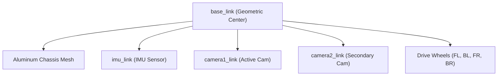

# SECBot Simulation & Motion System Overview

This document provides a technical reference for the SECBot's physical configuration, software architecture, and performance limits. Use this as a guide for development and troubleshooting.

## 1. Centralized Configuration

All robot-specific constants are stored in a single source of truth. **Always edit this file instead of hardcoding values in scripts.**

- **Location**: `ros2_ws/src/my_robot_description/config/motion_config.yaml`
- **Unit Standard**: All values are in **SI Units** (meters, radians, seconds).

### Key Parameters:

| Parameter        | Value (SI) | Description                               |
| :--------------- | :--------- | :---------------------------------------- |
| `track_width`    | 0.303022 m | Wheel-to-wheel center distance (11.93")   |
| `wheel_diameter` | 0.08255 m  | Physical diameter of drive wheels (3.25") |
| `gear_ratio`     | 0.6        | Motor-to-wheel speed ratio                |
| `max_velocity`   | 0.6096 m/s | Safe navigation speed limit               |

---

## 2. Kinematics & URDF Mapping

The robot uses a **Differential Drive** kinematics model. For precisely synchronized movements in Gazebo, the wheels are grouped into virtual "centers".

### Joint & Link Names:

- **Actuators**: `frontleftwheel`, `backleftwheel`, `frontrightwheel`, `backrightwheel`
- **Virtual Links**: `leftcenter`, `rightcenter` (Master joints for Control)
- **Sensors**: `imu_link`, `camera1_link`, `camera2_link`

### TF Tree Hierarchy:

The transform tree ensures that sensor data (like IMU and Camera) is correctly localized relative to the robot's center.



---

## 3. ROS Topic Map

The `ros_gz_bridge` facilitates communication between the Gazebo physics engine and the ROS 2 software stack.

| Topic                | Direction | Data Type                | Description                |
| :------------------- | :-------- | :----------------------- | :------------------------- |
| `/cmd_vel`           | ROS -> GZ | `geometry_msgs/Twist`    | Velocity commands          |
| `/odom`              | GZ -> ROS | `nav_msgs/Odometry`      | Calculated robot pose      |
| `/imu`               | GZ -> ROS | `sensor_msgs/Imu`        | Raw IMU orientation/accel  |
| `/tf`                | GZ -> ROS | `tf2_msgs/TFMessage`     | Dynamic frame transforms   |
| `/joint_states`      | GZ -> ROS | `sensor_msgs/JointState` | Physical wheel positions   |
| `/odom/ground_truth` | GZ -> ROS | `nav_msgs/Odometry`      | **Physics-true** reference |

---

## 4. Navigation & Performance Limits

Based on the **Speed Calibration Sweep**, the following limits represent the "safe zone" where robot odometry drift is minimized.

- **Maximum Safe Linear Speed**: `1.0 m/s`
- **Maximum Safe Angular Speed**: `1.0 rad/s`
- **Observed Accuracy**: **< 2.0% error** at 1.0 m/s.
- **Target Accuracy Threshold**: Fail if error > 5.0%.

---

## 5. Developer Workflows

### Running Accuracy Calibration

To verify the robot's hardware/physics tuning:

```bash
# Start the minimal calibration environment
ros2 launch secbot_sim sensor_calib.launch.py

# Run a full speed sweep (0.05 to 1.0 m/s)
ros2 run secbot_sim speed_calibration_sweep.py
```

There also exists motion_calibration_test.py for testing aswell. for more of a do movement or rotation directly without the need for a nav goal.
