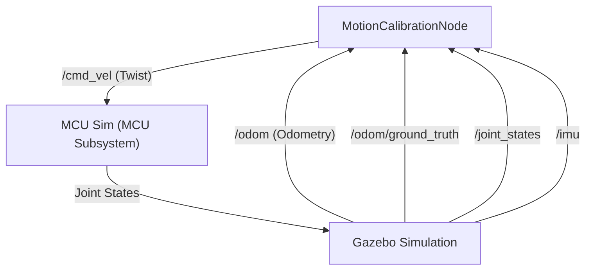

# SECBot Simulation: Control & Navigation Analysis

This document analyzes the robot control logic and navigation styles used in the calibration scripts: `motion_calibration_test.py` and `speed_calibration_sweep.py`.

## 1. Core Architecture

The primary actor is the `MotionCalibrationNode`, defined in `motion_calibration_test.py`. It serves as a specialized test controller for the SECBot.

### Node Diagram



## 2. Communication Interface

### Subscriptions (Feedback)

| Topic                | Type                     | Purpose                                                           |
| :------------------- | :----------------------- | :---------------------------------------------------------------- |
| `/odom`              | `nav_msgs/Odometry`      | Standard wheel-odometry calculated by the robot's drive plugin.   |
| `/odom/ground_truth` | `nav_msgs/Odometry`      | Physics-perfect position from Gazebo (Ground Truth).              |
| `/joint_states`      | `sensor_msgs/JointState` | Raw wheel rotation data (radians) for encoder-based calculations. |
| `/imu`               | `sensor_msgs/Imu`        | Orientation and angular velocity for closed-loop turning.         |

### Publications (Control)

| Topic      | Type                  | Purpose                                             |
| :--------- | :-------------------- | :-------------------------------------------------- |
| `/cmd_vel` | `geometry_msgs/Twist` | Sends linear (x) and angular (z) velocity commands. |

## 3. Control & Navigation Styles

The testing pages employ three distinct styles of robot control:

### A. Open-Loop Timed Motion

Commands the robot to move at a specific velocity for a calculated duration.

- **Used in:** Basic linear and angular tests in `motion_calibration_test.py`.
- **Logic:** `duration = abs(target_distance) / abs(commanded_speed)`.
- **Pros:** Simple, requires no sensor feedback.
- **Cons:** Inaccurate due to physics startup lag, wheel slip, or simulation jitter.

### B. Closed-Loop Feedback (IMU)

Commands the robot to turn until a specific sensor threshold is met.

- **Used in:** `_run_turn_test` when `--closed-loop` is enabled.
- **Logic:** Subscribes to `/imu`, tracks `imu_cumulative_yaw`, and stops exactly when the target relative angle is reached.
- **Pros:** Much higher accuracy for rotations regardless of friction or slip.

### C. Speed Sweeping

An iterative control style used to profile robot performance across a range of velocities.

- **Used in:** `speed_calibration_sweep.py`.
- **Logic:** Dynamically instantiates `MotionCalibrationNode` with varying speed parameters, performing repetitive "Drive -> Reset -> Drive" cycles to stay within the simulation bounds.

### D. Square Movement (Navigation Prep)

Sequences linear and angular primitives to execute a predictable 2D geometry.

- **Used in:** `square_movement_test.py`.
- **Logic:** Executes a loop of 4x (Drive 1.0m -> Settle -> Turn 90° CCW -> Settle).
- **Pros:** Validates odometry drift and 2D accuracy before building full pathing.
- **Reporting**: Compares the Robot's final ground-truth position to $(0,0)$ to calculate **Total Drift**.

## 4. How They Are Used in Testing

### `motion_calibration_test.py`

This script uses **Snapshot Comparison**. It captures the robot's state (Pos A), executes a movement command (Style A or B), waits for the robot to settle, and captures the state again (Pos B). The difference (`Pos B - Pos A`) is then compared against the commanded value to calculate error percentages.

### `speed_calibration_sweep.py`

This script leverages the `MotionCalibrationNode` as a library. It iterates through a list of speeds (e.g., 0.05 m/s to 1.0 m/s) and runs individual linear and angular tests at each step.

### `square_movement_test.py`

This script demonstrates **Primitive Navigation**. It utilizes the `MotionCalibrationNode` as a base class to chain 8 distinct movements (4 sides, 4 corners). It provides per-step error reporting and a final cumulative drift calculation, crucial for tuning the robot's physical constants.

## 5. Walkthrough: Primitive Navigation Setup

To transition from calibration to navigation, you can sequence these primitive movements (Linear + Angular) to reach specific coordinates. This is often called "Bang-Bang" navigation or "Wait-and-Push".

### The "L-Pattern" Strategy

The simplest way to move to a relative point $(x, y)$ is:

1.  **Rotate** to align with the X-axis.
2.  **Drive** distance $x$.
3.  **Rotate** 90 degrees.
4.  **Drive** distance $y$.

### Code Implementation Example

You can create a new script (e.g., `primitive_nav.py`) that reuse the `MotionCalibrationNode` logic:

```python
from motion_calibration_test import MotionCalibrationNode
import math

def main():
    # 1. Initialize the control node
    node = MotionCalibrationNode(speed=0.2, turn_speed=0.5, closed_loop=True)

    # 2. Sequence Movements (+1.0m Forward, then +90° CCW Rotation)
    node.get_logger().info("Starting Navigation Sequence...")

    # Step A: Move Forward 1 meter
    node._run_linear_test("Nav Step 1: Forward", 1.0)

    # Step B: Settle
    node._settle()

    # Step C: Rotate 90 degrees Left (Positive Rad)
    node._run_turn_test("Nav Step 2: Left Turn", math.pi / 2)

    # Step D: Final Settle
    node._settle()

    node.get_logger().info("Navigation Sequence Complete ✓")

if __name__ == "__main__":
    main()
```

### Why use this for prep?

- **Validation**: It proves your `motion_config.yaml` is accurate before you introduce complex path planners.
- **Odometry Check**: You can verify if the robot's real position (Gazebo GT) matches where the encoders think they are after multiple steps.
- **Closed-Loop Reliability**: By using `closed_loop=True` for turns, you ensure that even if the robot slips during the forward move, it will re-orient correctly based on the IMU.

---

> [!NOTE]
> The scripts account for the 4-wheel configuration where the naming in the URDF might be swapped relative to physical sides (e.g., Left side mapping to `rf_rad` and `rb_rad` in some plugins).
